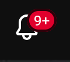
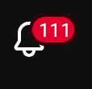

# YouTube Notification Bell Expander

Replaces 9+ in the YouTube notification bell with the actual number

Normally it looks like this:

After installing the extension, it looks like this:

## Installation

### Firefox

#### Add-on Store

[https://addons.mozilla.org/en-CA/android/addon/youtube-notification-expander/](Add-on Store page)

#### Manual Installation (not recommended)

You can download the latest version from Releases. After downloading, unzip the .zip file, go to `about:debugging` in Firefox, click "This Firefox", then "Load Temporary Add-on", and select the `manifest.json` file from .zip/firefox/manifest.json. 

### Tampermonkey

Tampermonkey installation is also available. You can download the latest version from Releases. After downloading, unzip the .zip file, go to your Tampermonkey dashboard, click "Utilities", then "Import", and select the `main.js` file from .zip/tampermonkey/main.js.
